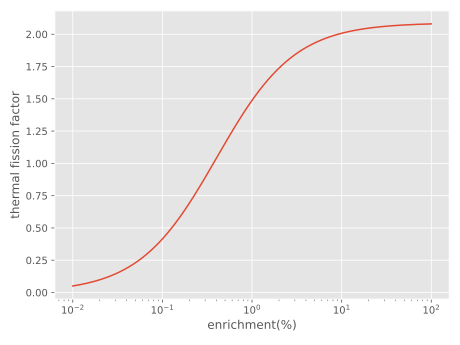
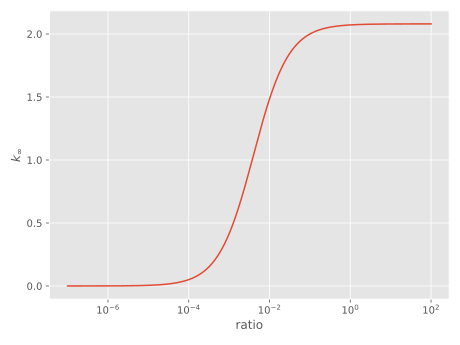

## Question 1

How many scatters with $\ce{^1H}$ and with $\ce{^235U}$, on the average, would it take for $\pu{2MeV}$ neutrons to reach an average thermal energy of $\pu{0.025 eV}$?

### Answer

The average logarithmic energy loss is
$$
\xi = \overline{\ln \frac E{E'}}=1+\frac{\alpha}{1-\alpha}\ln\alpha,\alpha=\left(\frac{A-1}{A+1}\right)^2
$$
So the average scatter time is
$$
n=\frac 1{\xi} \ln\frac{E_i}{E_f}
$$
For this exercise, the total logarithmic energy loss is 

$$
\ln\frac{E_i}{E_f}=\ln(\frac{\pu{2MeV}}{\pu{0.025eV}})=18.198
$$

For $\ce{^1H}$, $A_{\ce{^1H}}=\pu{1.00783u},\xi =0.99983$, thus
$$
n(\ce{^1H})=\frac{18.198}{0.99983}=18
$$
For $\ce{^235U}$, $A_{\ce{^235U}}=\pu{235.044u},\xi=0.008485$, thus
$$
n(\ce{^235U})=\frac{18.198}{0.008485}=2145
$$

## Question 2

Discuss the relative merits of water and graphite for use in a thermal reactor.

### Answer

Water: 

- much less expensive
- can also be used as the coolant for a power reactor
- boils at lower temperatures and thus require a pressure vessel
- $\sigma_a$ is relatively large ($0.664\,\mathrm{b}$)
- larger $\xi$ and slows neutrons with fewer scatters
- much more inert chemically
- cannot be used as a structural element of the core
- can produce radioactive ${ }^3 \mathrm{H}$ and ${ }^{16} \mathrm{~N}$ by activation
- can dissociate and produce explosive hydrogen-oxygen gas mixtures

Graphite:

- reactor-grade (high purity) graphite is expensive
- cannot be used as the coolant
- solid to very high temperatures; thus no need for a pressure vessel
- $\sigma_a$ is very small ($34\,\mathrm{mb}$)
- smaller $\xi$ and requires more scatters to slow neutrons
- burns and thus hot graphite must be isolated from oxygen
- can be used as structural elements of the core
- does not activate and produce radionuclides
- stores energy and must be periodically annealed to avoid a sudden energy release (Wigner effect).

## Question 3

Plot the thermal fission factor for uranium as a function of its atom-% enrichment in $\ce{^235U}$.

### Answer

The thermal fission factor is
$$
\eta=\nu\frac{\bar\Sigma_f}{\bar\Sigma_a}=\frac{\nu_{235}\bar\sigma_f^{235}}{\bar\sigma_a^{235}+\bar\sigma_a^{238}(N^{238}/N^{235})}
$$
By definition of enrichment, $e$,
$$
\frac{N^{235}}{N^{238}+N^{235}}=e\Rightarrow\frac{N^{238}}{N^{235}}=\frac{e}{1-e}
$$
From Tabel 10.1 and Table 10.2 of our text book,
$$
\bar\sigma_a^{235}=\pu{592.6 b},\sigma_a^{238}=\pu{2.382 b},\sigma_f^{235}=\pu{505.9 b},\nu^{235}=2.4367
$$
Bring these in we get the relationship of $\eta$ and $e$:
$$
\eta=\frac{\nu_{235}\sigma_f^{235}}{\sigma_a^{235}+\sigma_a^{238}\frac{e}{1-e}}
$$
By those python code, we can plot it out:



```python
# import matplotlib.pyplot as plt
# import numpy as np
# import astropy.units as u
sigma_a_235 = 592.6#*u.barn
sigma_a_238 = 2.382#*u.barn
sigma_f_235 = 505.9#*u.barn
nu235=2.4367

e = np.logspace(-4,-0,1000)
eta = nu235*sigma_f_235/(sigma_a_235+sigma_a_238*(1-e)/e)
plt.plot(e*100,eta)
plt.xlabel('enrichment(%)')
plt.xscale('log')
plt.ylabel('thermal fission factor')
plt.yscale('linear')
# plt.yticks((0,1,2))
plt.grid(True)
plt.savefig('hw3c_3.svg')
plt.show()
```

## Question 4

Consider a homogeneous mixture of fully enriched $\ce{^235U}$ and graphite. Plot $k_\infty$ versus $N^{235}/N^c$. What is the fuel-to-moderator ratio that yields the maximum value of $k_\infty$?

### Answer

$$
k_\infty=\eta \epsilon p f 
$$

For a dilute mixture of fully enriched uranium and carbon, $\epsilon p\approx 1$, thus
$$
k_\infty = \eta f=\frac{\nu^{235}\bar\sigma_f^{235}}{\bar\sigma_{a}^{235}+\bar\sigma_a^{c}\frac{N^c}{N^{235}}}=\frac{\nu^{235}\bar\sigma_f^{235}}{\bar\sigma_{a}^{235}+\bar\sigma_a^{c}r^{-1}}
\\\bar \sigma_a^c = (\sqrt \pi/2)\sigma_a^c=\pu{3.422 mb}
$$
Bring these in and we can plot it out by the code below



```python
# import matplotlib.pyplot as plt
# import numpy as np
# import astropy.units as u
sigma_a_235 = 592.6#*u.barn
sigma_a_238 = 2.382#*u.barn
sigma_f_235 = 505.9#*u.barn
nu235=2.4367

e = np.logspace(-4,-0,1000)
eta = nu235*sigma_f_235/(sigma_a_235+sigma_a_238*(1-e)/e)
plt.plot(e*100,eta)
plt.xlabel('ratio')
plt.xscale('log')
plt.ylabel(r'$k_\infty$')
plt.yscale('linear')
# plt.yticks((0,1,2))
plt.grid(True)
plt.savefig('hw3c_3.svg')
plt.show()
```


## Question 5

Two detectors, placed symmetrically on either side of a fission source, record two fission fragments $f_1$ and $f_2$ from a fission event. If the flight time for $f_1$ is $20\%$ greater than that for $f_2$, calculate the ratio of the masses of $f_1$ and $f_2$ . Which has the most energy?

### Answer

Because the detectors are placed symmetrically, the flight time is.
$$
t_{\text{flight}}=\frac{L}{v}
$$
One can derive
$$
(t_1-t_2)/t_2=0.2\Rightarrow t_1/t_2=1.2.
$$
So $v_1/v_2=t_2/t_2$. For the conservation of momentum
$$
m_1v_1=m_2v_2
\Rightarrow m_1/m_2=v_2/v_1=t_1/t_2.
$$
So for the energy ratio
$$
E_1/E_2=m_1/m_2 (v_1/v_2)^2=t_2/t_1=5/6
$$
So the second fragment $f_2$ has the most energy.